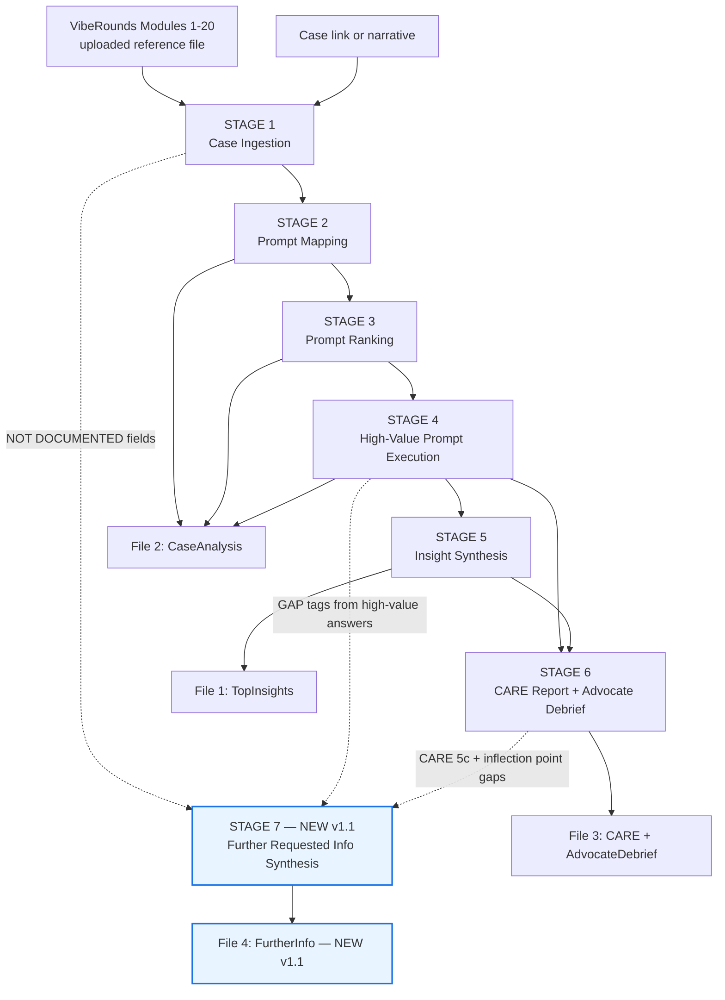
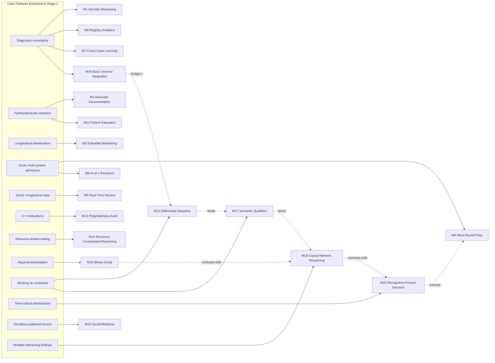
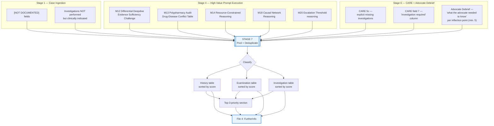
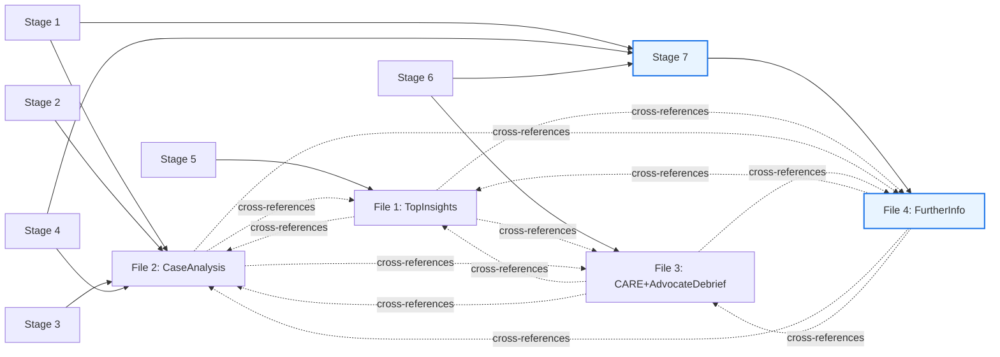

# VibeRounds — Protocol Dependency & Network Map

**Companion to:** VibeRounds Master Case Analysis Protocol v1.1
**Purpose:** Show exactly what each stage, sub-step, and output file depends on — case data, prior stage outputs, or other modules — so the pipeline can be executed, debugged, or partially re-run with a clear picture of what breaks if an upstream piece is missing or wrong.
**How to read this file:** Start with the Macro Dependency Graph (the seven stages), then drop into the Module-Level Dependency Map (what triggers which of the 20 modules), then the Case-Field Dependency Table (what raw case data each stage actually consumes), then the Stage 7 Gap-Pooling Map (the new v1.1 addition), then the Output File Dependency Map (what each of the four files draws from).

---

## 1. Macro Dependency Graph — The Seven Stages

This is the top-level sequence dependency. Every stage downstream of Stage 1 requires Stage 1's structured extraction to exist; nothing after Stage 4 can run meaningfully without Stage 4 answers; Stage 7 is the only stage that reads from three non-adjacent upstream stages at once rather than just the one immediately before it.

**Critical-path reading:** Stages 1 → 2 → 3 → 4 are strictly sequential and blocking — each one requires the previous to be complete and correct. Stages 5 and 6 both branch from Stage 4 and can in principle run in parallel, but Stage 6 also benefits from Stage 5 being complete (CARE field 2's "Key Learning Points" naturally draws on Stage 5 insights). Stage 7 is structurally different: it does not wait for one predecessor, it pools from three (Stage 1, Stage 4, Stage 6) and so cannot start until **all three** are finished, not just the most recent one.

---

## 2. Module-Level Dependency Map — Stage 2/3/4 Internals

Stage 2's prompt mapping is itself a dependency engine: which of the 20 modules activate depends entirely on which clinical features Stage 1 extracted. This map shows that trigger logic as a network rather than a flat table, so you can see which case features have the widest downstream reach.

**Reading this graph:** Solid arrows are direct trigger relationships from the Stage 2 mapping table in the Master Protocol. Dotted arrows are **inter-module dependencies that exist inside the module library itself** (drawn from the modules' own "Related Frameworks" cross-references) — these matter because if a case triggers M18 (Causal Network Reasoning), the quality of that answer is improved by also having M17 (Semantic Qualifiers) answered first, since a sharp problem representation is what M18's network nodes are built from. Similarly M20 explicitly extends M4 Step 4.4, so if both are triggered, M4 should logically be answered before M20 for the escalation-threshold reasoning to build on something rather than starting cold.

---

## 3. Case-Field → Stage Dependency Table

This table makes explicit which raw Stage 1 fields each later stage actually consumes. Use it to predict what breaks downstream if a specific Stage 1 field is thin or marked `[NOT DOCUMENTED]`.

| Stage 1 Field | Consumed Directly By | Breaks Downstream If Missing |
|---|---|---|
| Patient demographics | CARE field 4, File naming convention (`[CaseName]`), M19 | Case naming defaults to generic; M19 social-medicine prompts cannot trigger |
| Chief complaint / mode of presentation | Stage 2 mapping, CARE field 1 (Title), M20 trigger | Title generation in CARE report has no anchor; M20 cannot detect time-critical framing |
| Background history | M1, M12, M15 (illness script comparison) | Differential deepdive (M12) loses its "what was already known" baseline |
| Symptom timeline | CARE field 6 (Timeline), M18 (sequential reweighting), M20 | Timeline and causal network reasoning cannot be built — both depend on chronological ordering |
| Medications | M13 (polypharmacy), CARE 8 (interventions) | M13 cannot trigger at all without 5+ documented medications; drug-disease conflict table in Stage 4 has nothing to populate |
| Examination findings | CARE 5b, M16 (mechanism bridge), M18 nodes | Examination findings table in CARE report is empty or thin; mechanism-to-diagnosis prompts lose their clinical anchor |
| Investigations | CARE 5c, Stage 7 pooling (Investigation category) | This is the single field with the most Stage 7 downstream impact — see Section 4 |
| Procedures performed | CARE field 8 | Therapeutic interventions table loses rows |
| Working diagnoses at presentation | M12 (attack target), CARE field 7 | M12's entire "working diagnosis attack" step has no target to challenge |
| Management given | CARE field 8, M13 | Drug-disease conflict and prescribing-cascade detection (M13) lose their input |
| Outcome | CARE field 9, Stage 5 insight framing | Insight synthesis cannot state "correct response" against a known outcome |
| Investigations NOT performed but indicated | CARE 5c (explicit flag), **Stage 7 — primary input** | This field is effectively a pre-built seed list for Stage 7; if Stage 1 skips it, Stage 7 must reconstruct it from scratch later, which is fragile |
| Patient/advocate narrative | M2, M11, CARE field 11, Advocate Debrief (all of 6B) | If absent, all of Module 6B (Advocate Debrief) degrades to the `[Not documented]` fallback — this is the single highest-impact missing field for File 3 |

---

## 4. Stage 7 Gap-Pooling Map *(NEW in v1.1)*

Stage 7 is structurally different from every other stage: instead of one predecessor, it has **three non-adjacent feeder stages**, each surfacing gaps for a different underlying reason. This diagram shows exactly which sub-step inside each feeder stage is responsible for generating `[GAP]` entries, and how those entries route into the three Stage 7 output categories (History / Examination / Investigation).

**Why this matters for execution order:** Because Stage 7 pools from Stage 4 *and* Stage 6, and Stage 6 itself depends on Stage 4 being complete, Stage 7 has the longest dependency chain of any stage in the pipeline (Stage 1 → Stage 4 → Stage 6 → Stage 7 is four deep, versus three deep for everything else). This is also why the Master Protocol instructs the AI to maintain a running gap log starting in Stage 1, rather than trying to reconstruct all gaps retrospectively at Stage 7 — re-mining three prior stages' full text from scratch at the end is far more failure-prone than tagging gaps inline as they're first noticed.

| Feeder Source | Typical Gap Type Produced | Stage 7 Category |
|---|---|---|
| Stage 1 `[NOT DOCUMENTED]` fields | Could be any of the three | History / Examination / Investigation (classify per field) |
| Stage 1 "investigations NOT performed" | Pre-classified | Investigation |
| Stage 4 — M12 Evidence Sufficiency Challenge | Missing test that would confirm/exclude a differential | Investigation (occasionally Examination) |
| Stage 4 — M13 Polypharmacy Audit | Missing medication history detail (e.g. OTC use, herbal supplements, adherence pattern) | History |
| Stage 4 — M14 Resource-Constrained Reasoning | Missing alternative/lower-cost investigation that was feasible but not ordered | Investigation |
| Stage 4 — M18 Causal Network Reasoning | A finding whose absence prevents resolving which of two competing causal explanations is correct | Investigation or History (depends on what would resolve it) |
| Stage 4 — M20 Escalation Threshold reasoning | A specific monitoring parameter or repeat examination that should have been tracked but wasn't | Examination |
| Stage 6 — CARE 5c | Explicitly flagged missing investigation | Investigation |
| Stage 6 — CARE field 7 differential table | "Investigation required" column entries | Investigation |
| Stage 6 — Advocate Debrief inflection points | Plain-language history/symptom detail the advocate was never asked about | History |

---

## 5. Output File Dependency Map

This shows what each of the four output files actually draws from, so a partial re-run (e.g. "just regenerate File 4") can be scoped correctly — you can see exactly which stages must already be complete and correct before that file can be written or rewritten.

| File | Direct Stage Dependencies | Indirect (Transitive) Dependencies | Can Be Regenerated Alone? |
|---|---|---|---|
| File 1 — TopInsights | Stage 5 | Stages 1–4 (Stage 5 is built from all of them) | No — needs Stage 5 output, which needs everything before it |
| File 2 — CaseAnalysis | Stages 1, 2, 3, 4 | None beyond its direct stages | Yes, once Stages 1–4 are complete — does not need Stage 5 or 6 |
| File 3 — CARE + AdvocateDebrief | Stage 6 | Stages 1–5 (Stage 6 draws on Stage 5 for CARE field 2) | No — needs Stage 6, which needs Stage 5, which needs Stage 4 |
| File 4 — FurtherInfo *(NEW)* | Stage 7 | Stages 1, 4, 6 directly; Stages 2, 3, 5 transitively (since Stage 6 needs Stage 5, which needs Stage 4, which needs Stages 2–3) | No — has the deepest dependency chain of any file in the pipeline |

**Practical implication:** File 2 is the only output that can be safely regenerated in isolation without re-running the entire pipeline (e.g. if you want to re-rank prompts with a different scoring emphasis). Files 1, 3, and 4 all transitively require the full pipeline to have run at least once, with File 4 requiring the most — it is the last possible thing to finalize, and the first thing to break if any upstream gap-tagging discipline was skipped.

---

## 6. Quick-Reference: "If X Is Missing, What Breaks"

A condensed failure-mode lookup, useful when triaging a thin or partial case source before committing to a full run.

| If this is missing or thin... | ...these break or degrade |
|---|---|
| Investigations NOT performed but indicated (Stage 1) | CARE 5c, Stage 7 Investigation table — the protocol's single most consequential field |
| Patient/advocate narrative (Stage 1) | M2, M11, CARE field 11, all of File 3 Part B (Advocate Debrief) |
| 5+ medications documented (Stage 1) | M13 cannot trigger; Stage 4 has no drug-disease conflict table to produce; Stage 7 History category loses its main medication-history source |
| Symptom timeline (Stage 1) | CARE field 6, M18, M20 — three separate downstream consumers |
| Working diagnosis stated (Stage 1) | M12's entire devil's-advocate attack has no target; CARE field 7's "unestablished diagnoses" table has nothing to differentiate against |
| Stage 4 minimum-15/minimum-8 prompt threshold not met | Quality gate fails before Stage 4 even starts — protocol requires flagging this and requesting more case detail rather than proceeding |
| `[GAP]` tagging skipped during Stage 4 | Stage 7 must retrospectively re-mine Stage 4's full text, which is slower and more failure-prone than inline tagging — see Protocol Maintenance Notes in the Master Protocol |
| CARE 5c not explicitly flagged in Stage 6 | Stage 7's Investigation category loses its single richest, most pre-classified source |

---

*VibeRounds Protocol Dependency & Network Map — companion to Master Protocol v1.1, June 2026*
*This file is a structural/navigational aid for executing and debugging the pipeline. It does not itself constitute clinical guidance.*
